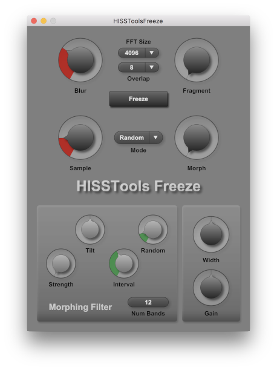

HISSTools Freeze
========



HISSTools Freeze is a lightweight plugin for spectral freezing and morphing based on DSP built in [FrameLib](https://github.com/AlexHarker/FrameLib).
* HISSTools Freeze was originally built for teaching purposes at the University of Huddersfield.
* It supports several different freezing/morphing modes that allow control over the evolution of the output sound.
* A randomisable multi-band filter allows the user to add movement to the sound.
* A full manual can be found [here](https://github.com/AlexHarker/HISSTools_Freeze/blob/main/manual/HISSTools_Freeze_User_Guide.pdf).

Formats / OS:
---------------------------------
- HISSTools Freeze is curently provided as AUv2 (mac only) and VST2 / VST3 (mac / windows).
- Other formats are support by iPlug 2 but not yet configured to build correctly.

To Install the Plugin:
---------------------------------
- Automated builds of the plugin can be found on the [releases](https://github.com/AlexHarker/HISSTools_Freeze/releases) page of GitHub (the latest version is at the top).
- If you do not **need** to build from source you are strongly advised to download the official builds linked above, rather than to download the source code / repository available directly from the frontpage of the repo on GitHub.

To Build the Plugin:
---------------------------------
- You will require a fully setup version of [iPlug 2](https://github.com/iPlug2/iPlug2).
- This repo is designed to be placed in a subfolder of the iPlug 2 repository (e.g. iPlug2/Projects).
- The [HISSTools_PlugiLib](https://github.com/AlexHarker/HISSTools_PluginLib) repo is also required to be placed next to this one before building (e.g. iPlug2/Projects).
- The [FrameLib](https://github.com/AlexHarker/HISSTools_PluginLib) repo is also required to be placed next to the iPlug 2 repo before building (i.e. at iPlug2/../FrameLib).
- You must build the FrameLib libs (for 'Deployment' on mac or the 'Static' configuration on windows) and place the resultant libs in the following location in **this** repo before building the plugin:
  - *Mac:* 
    - ```./dependencies/build/libframelib_objects.a```
  - *Windows:*
    - ```./dependencies/build/framelib.lib```
    - ```.dependencies/build/framelib_objects.lib```
- The supplied Xcode workspace and Visual Studio solution should then build the valid plugin formats (AUv2 / VST2 / VST3) correctly.

HISSTools Freeze Makes Use Of:
---------------------------------

- **iPlug 2** - a C++ audio plug-in framework for desktop, mobile (iOS) and web<br>
https://github.com/iPlug2/iPlug2

- **HISSTools_PluginLib** - Common code that provides UI controls /  DSP for all HISSTools plugins<br>
https://github.com/AlexHarker/HISSTools_PluginLib

- **FrameLib** - A DSP framework for arbitrary size frame processing with arbitrary sub-sample accurate timing<br>
https://github.com/AlexHarker/FrameLib

Credits
---------------------------------
**HISSTools Freeze** by *Alex Harker* <br>
CeReNeM - The University of Huddersfield

Contact:
---------------------------------

* ajharker@gmail.com
